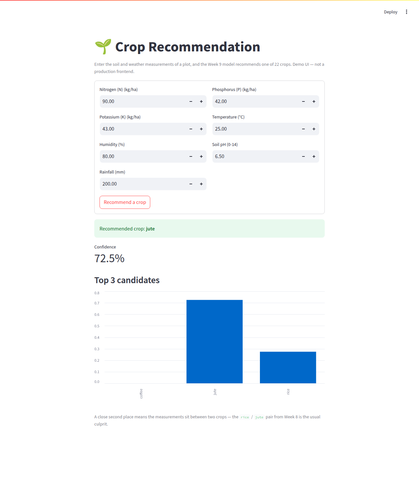

# 🌱 Crop Recommendation System

[](https://github.com/Raj-Indra-Asura/Crop-Recommendation-System/actions/workflows/ci.yml)

**Given the soil and weather measurements of a plot of land, recommend the crop
most suited to it** — as a trained scikit-learn model, a documented HTTP API, a
container, and a twelve-week course that builds all three from zero.

```
Input:  N=90, P=42, K=43, temperature=25, humidity=80, ph=6.5, rainfall=200
Output: jute   (confidence 0.7253; runner-up rice, 0.2747)
```

Supervised **multiclass classification** over 22 crops and 7 numeric features.
The shipped model is **Gaussian naive Bayes**, chosen in Week 8 over twelve
other configurations, scoring **99.55%** (438/440) on a test set opened exactly
once.

> ### ⚠️ This is not agronomic advice
>
> This is a demonstration model trained on a single 2,200-row public dataset of
> **unknown provenance**. It knows nothing about your region, soil type, season,
> water access, market or budget, and its confidence numbers are the model's
> internal arithmetic — not a probability that planting will succeed.
> **Do not use it to make a real planting decision.** Talk to an agronomist or
> an agricultural extension service. The full account is in
> [Limitations and ethics](#limitations-and-ethics).

---

## Contents

[Quickstart](#quickstart) · [Architecture](#architecture) ·
[Results](#results) · [Using it](#using-it) ·
[Limitations and ethics](#limitations-and-ethics) ·
[What production would add](#what-production-would-add) ·
[Repository layout](#repository-layout) · [The course](#the-course-12-weeks) ·
[Dataset](#dataset)

---

## Quickstart

Targets Python 3.11; 3.12 also works and is what the recorded outputs below were
captured on.

```bash
# 1. Clone and enter the repository
git clone https://github.com/Raj-Indra-Asura/Crop-Recommendation-System.git
cd Crop-Recommendation-System

# 2. Create an isolated environment
python -m venv venv && source venv/bin/activate    # Windows: venv\Scripts\activate

# 3. Install pinned dependencies
pip install -r requirements.txt

# 4. Check everything works
ruff check .
pytest
```

```
All checks passed!
404 passed, 1 skipped in 29.62s
```

Then pick an entry point:

```bash
python -m src.pipelines.predict_pipeline           # one prediction on stdout
uvicorn api.main:app --host 127.0.0.1 --port 8000  # the API, docs at /docs
streamlit run app/streamlit_app.py                 # the demo form, on :8501
jupyter notebook notebooks/                        # the seven course notebooks
```

Or skip Python entirely — with Docker installed, the API is two commands:

```bash
docker build -t crop-api -f deployment/Dockerfile .
docker run -p 8000:8000 crop-api
curl http://127.0.0.1:8000/health
```

```json
{"status":"ok","model_loaded":true,"n_classes":22}
```

The trained artifact is **not** committed — it is derived from the committed
data, the committed code and the pinned `requirements.txt`. `predict()` trains
one on demand when `models/crop_model.joblib` is missing, so a clean clone works
with no extra step. Full container instructions, ports and troubleshooting:
[`docs/deployment_guide.md`](docs/deployment_guide.md).

---

## Architecture

Full diagrams, the layering rule and the failure mode of every hop:
[**`docs/architecture.md`**](docs/architecture.md).

```
data/raw/Crop_recommendation.csv        2,200 rows · 22 crops · committed
        |  src/data/data_loader.py      validates columns, dtypes, size, labels    (W1)
        v
   src/data/split.py                    stratified 80/20 -> 1,760 / 440            (W3)
        |
        v
src/preprocessing/preprocessor.py       ColumnTransformer, fitted on train only    (W3)
        |
        v
src/models/classical_models.py          GaussianNB(var_smoothing=1e-9)      (W5, chosen W8)
        |
        v
src/pipelines/training_pipeline.py      one Pipeline -> models/crop_model.joblib   (W9)
        |                               test accuracy 0.9955 · macro F1 0.9954
        v
src/pipelines/predict_pipeline.py       predict({...}) -> "jute"                   (W9)
        |
        +--------------+
        v              v
   api/main.py      app/streamlit_app.py                                          (W10)
   POST /predict    in-process call, no HTTP
   api/schemas.py   validates 7 fields -> 422
        |
        v
   {"crop":"jute","confidence":0.7253,...}    also inside deployment/Dockerfile    (W11)
```

Both entry points depend on the same `predict()`. `api/` never imports `app/`,
`app/` never imports `api/`, and `src/` imports neither.

---

## Results

Thirteen model configurations were trained across Weeks 4-8. **Every one is listed
here**, because the evidence that a model was *chosen* is the list of the models
it was chosen over.

**Protocol:** 5-fold stratified cross-validation on the 1,760 training rows,
identical folds for every model, seeded (`RANDOM_STATE = 42`). `±` is the
fold-to-fold standard deviation. `data/processed/test.csv` was not opened until
Week 8, and then only for the two finalists.

| Model | Week | CV accuracy (train folds) | Test (440 held-out rows) |
| --- | --- | --- | --- |
| `DummyClassifier(most_frequent)` — the baseline | 04 | 0.0455 ± 0.0000 | — |
| `DummyClassifier(prior)` | 04 | 0.0455 ± 0.0000 | — |
| `DummyClassifier(uniform)` | 04 | 0.0466 ± 0.0073 | — |
| `DummyClassifier(stratified)` | 04 | 0.0472 ± 0.0064 | — |
| K-nearest neighbours (`k=5`) | 05 | 0.9653 ± 0.0121 | — |
| Logistic regression | 05 | 0.9682 ± 0.0066 | — |
| SVM (RBF kernel, `C=1`) | 06 | 0.9790 ± 0.0103 | — |
| SVM (linear kernel, `C=1`) | 06 | 0.9818 ± 0.0077 | — |
| Decision tree | 06 | 0.9852 ± 0.0068 | — |
| Gradient boosting (XGBoost) | 07 | 0.9909 ± 0.0033 | — |
| Random forest (untuned, 100 trees) | 07 | 0.9926 ± 0.0058 | — |
| Random forest (grid-searched, 24 candidates) | 08 | 0.9943 ± 0.0060 | 0.9955 |
| **➡ Gaussian naive Bayes — the shipped model** | **05, chosen 08** | **0.9949 ± 0.0042** | **0.9955** |

Notes a reader should not have to dig for:

* **The baseline is 4.55% (1/22)**, and no dummy strategy escapes it — the
  classes are perfectly balanced, so accuracy is a fair headline metric here.
* **Gradient boosting scores 0.9869 ± 0.0034 on the scikit-learn fallback.**
  `xgboost` is an optional pin; `get_gradient_boosting()` falls back
  automatically and records which backend answered.
* **Tuning bought nothing.** Grid search gained 0.0017 on the forest against a
  fold spread of 0.0060; naive Bayes' `var_smoothing` produced an *identical*
  score across twelve values spanning five orders of magnitude.
* **The top two are tied, not ranked.** 0.9949 vs 0.9926 is a 0.0023 gap inside
  both fold spreads, and both finalists score exactly 0.9955 on the test set.
  Naive Bayes ships because it is ~40x cheaper to fit, stores 308 numbers rather
  than a hundred trees, is directly interpretable, has no hyperparameter that
  changes its behaviour, and makes one *kind* of error rather than two.
* **The two errors are interesting.** Both are `rice -> jute`: the crops are
  separated by rainfall alone (237 mm vs 176 mm on average) and the misread
  field measured 186.75 mm. Full error analysis:
  [Week 8](docs/curriculum/week08/learning_notes.md).

Reproduce any row from that week's `validation.md`; explanations of a single
prediction (permutation importance and SHAP) are in
[`notebooks/07_model_explainability.ipynb`](notebooks/07_model_explainability.ipynb).

---

## Using it

### As a Python function

```python
from src.pipelines.predict_pipeline import predict, predict_proba

predict({"N": 90, "P": 42, "K": 43, "temperature": 25,
         "humidity": 80, "ph": 6.5, "rainfall": 200})
# -> 'jute'
```

### Over HTTP

```bash
uvicorn api.main:app --host 127.0.0.1 --port 8000

curl -X POST http://127.0.0.1:8000/predict -H "Content-Type: application/json" \
  -d '{"N":90,"P":42,"K":43,"temperature":25,"humidity":80,"ph":6.5,"rainfall":200}'
```

```json
{
  "crop": "jute",
  "confidence": 0.725342776978384,
  "probabilities": {"jute": 0.725342776978384, "rice": 0.2746571705151149, "coffee": 5.250650112483512e-08}
}
```

```bash
curl http://127.0.0.1:8000/health
```

```json
{"status":"ok","model_loaded":true,"n_classes":22}
```

| Endpoint | Method | Body | Success | Failure |
| --- | --- | --- | --- | --- |
| `/predict` | POST | the seven features, all required | **200** + crop, confidence, probabilities | **422** naming the offending field; **503** if no model is loaded |
| `/health` | GET | — | **200** + `model_loaded`, `n_classes` | — |
| `/docs` | GET | — | interactive OpenAPI page, generated from the same schemas | — |

The seven fields are typed and range-checked in
[`api/schemas.py`](api/schemas.py), and unknown keys are rejected rather than
silently ignored. An internal failure returns **500** with the traceback in the
server log and *not* in the response body.

### In a browser

```bash
streamlit run app/streamlit_app.py
```



The demo calls `predict()` **in-process** rather than over HTTP, so it runs
whether or not the API is up. That trade-off is argued in
[`docs/architecture.md`](docs/architecture.md).

---

## Limitations and ethics

The model is a Gaussian naive Bayes classifier: 308 stored numbers (a mean and a
variance per crop per feature) plus 22 class priors. It reflects the patterns of
**one dataset**, and nothing else.

**What the training data does not contain**

| Absent | Why it matters |
| --- | --- |
| Region, country, soil type | 90 kg/ha of nitrogen means different things on clay and on sand. The model has never heard of either. |
| Season, date, year | No sowing window, no multi-year variation, no climate trend. |
| Provenance | Published on Kaggle with no stated collection method. Exactly 100 rows per crop and near-perfect class separation are not what field measurements usually look like; the data may be simulated, augmented or compiled from agronomic tables. Nobody here knows. |
| Yield, cost, market price | It recommends a crop, not a *profitable* crop. |
| Irrigation, fertiliser plans, rotation history | Every one of which a real recommendation would depend on. |
| The cost of being wrong | All 22 crops are treated as equally valuable and every error as equally bad. A real error costs a season. |

**What 99.55% is.** The share of 440 held-out rows — drawn from the same
dataset, by the same stratified split — that this model labelled correctly,
measured once. It is **not** evidence about a field measured by somebody else's
sensor, in a country the dataset never names, in a later year. There is no
second dataset here, and a near-perfect score on a small, clean, perfectly
balanced dataset says at least as much about the dataset as about the model.

**Confidence is not certainty.** The returned number is a relative score across
22 classes normalised to sum to 1, not a probability that the crop will grow.
Naive Bayes multiplies seven likelihoods, which pushes outputs toward the
extremes: Week 10 found an out-of-distribution input answered at 99.99997%
confidence. Nothing in the model knows when it is being asked something it has
no evidence about.

**The failure mode is presentation.** The model is harmless; a screenshot of it
captioned "AI-powered crop recommendations for farmers" is not. The people most
likely to act on such a claim are the people least able to absorb a lost season.
Everything above is stated at length in
[Week 12's notes](docs/curriculum/week12/learning_notes.md) §4, which doubles as
this project's model card.

---

## What production would add

None of this is built. It is named because "what would you do next?" is the
question that follows "you deployed it?", and the honest answer is a list, in
order:

1. **Structured request logging** — one JSON line per prediction (inputs,
   output, confidence, model version). Everything below needs this data to
   exist. Logging field measurements with timestamps is also a privacy
   decision, not only a technical one.
2. **Model version in the response and in `/health`** — the difference between
   "the model was wrong" and "*which* model was wrong".
3. **Authentication and rate limiting** — today, anyone who can reach the port
   can spend the CPU.
4. **TLS and a real host** — a registry, a platform, a domain, a certificate.
   This is the step that makes it public, and it is not taken here.
5. **Input-distribution (data drift) monitoring**, weekly, against the Week 2
   training statistics.
6. **A model registry and a rollback path**, once more than one model is worth
   naming.
7. **Shadow deployment, then canary release**, for any replacement model.
8. **Alerting**, last — an alert on a number nobody has watched for a month gets
   muted in a week.

Why drift monitoring is genuinely hard *here*: ground truth arrives a growing
season late, is partial (you only learn about the crop that was planted), and is
biased (you only learn about people who took the advice).
[Week 12's notes](docs/curriculum/week12/learning_notes.md) §5 works through all
of it.

---

## Repository layout

| Path | Contents |
| --- | --- |
| `docs/curriculum/weekXX/` | The course: `syllabus`, `learning_notes`, `exercises`, `validation` per week |
| `docs/ml_concepts.md` | Every concept in the course, in teaching order, by week |
| `docs/glossary.md` | The same terms, alphabetically |
| `docs/architecture.md` | Raw CSV -> trained artifact -> served prediction, and the layering rule |
| `docs/deployment_guide.md` | Build, run and health-check the container |
| `data/raw/` | The original dataset — read-only, and deliberately **not** gitignored |
| `data/processed/` | Anything derived from it — from Week 3, the train/test splits |
| `src/` | Reusable, tested implementation code |
| `src/pipelines/` | Runnable entry points — train the model, predict from it (Week 9) |
| `api/` | The FastAPI service — schemas and endpoints (Week 10) |
| `app/` | The Streamlit demo UI (Week 10) |
| `deployment/` | The serving image: `Dockerfile` and its trimmed `requirements.txt` (Week 11) |
| `.github/workflows/` | Continuous integration — lint and tests on every push and PR (Week 11) |
| `notebooks/` | Exploratory analysis, importing from `src/` |
| `models/` | Trained artifacts — generated on demand, never committed |
| `tests/` | 405 automated tests, one file per capability |

Logic lives in `src/` and is imported by the notebooks, so notebooks and tests
exercise the same code. If `data/raw/Crop_recommendation.csv` is ever missing,
`load_data()` fails with a message naming the file and where to obtain it —
restore the committed file, and never substitute randomly generated data, or
every result in this repository is silently invalidated.

---

## The course (12 weeks)

A complete beginner's path from "what is machine learning" to a containerised,
CI-checked, documented service — one running example throughout. Each week has a
syllabus, ~600 lines of learning notes, exercises, and a validation document
with real pasted output.

| Week | Status | What it added |
| --- | --- | --- |
| 01 — Framing the problem, environment, loading & validating data | ✅ Complete | Dataset contract enforced by `validate_dataset()`; 20 tests passing. [Docs](docs/curriculum/week01/) |
| 02 — Exploratory data analysis | ✅ Complete | Statistics, distributions, correlation, outliers and data leakage; helpers in `src/utils/eda.py`, 42 tests passing. [Docs](docs/curriculum/week02/) |
| 03 — Data preparation | ✅ Complete | Label encoding, stratified 80/20 split and a train-fitted `ColumnTransformer`; helpers in `src/data/split.py` and `src/preprocessing/preprocessor.py`, 74 tests passing. [Docs](docs/curriculum/week03/) |
| 04 — Baseline models | ✅ Complete | `DummyClassifier` baseline at **4.55%** (1/22) under 5-fold stratified CV; helpers in `src/models/baseline.py` and `src/evaluation/metrics.py`, 112 tests passing. [Docs](docs/curriculum/week04/) |
| 05 — Classification models | ✅ Complete | Logistic regression, KNN and Gaussian naive Bayes compared on identical folds; best so far **99.49%** (naive Bayes) against the 4.55% baseline; helpers in `src/models/classical_models.py`, 169 tests passing. [Docs](docs/curriculum/week05/) |
| 06 — Margin-based & tree-based models | ✅ Complete | SVM and decision trees added to the same comparison; overfitting shown directly with a tree-depth sweep (100% train vs 98.52% validation) and decision boundaries drawn on two features; helpers in `src/models/classical_models.py` and `src/utils/visualization.py`, 231 tests passing. [Docs](docs/curriculum/week06/) |
| 07 — Ensemble models | ✅ Complete | Random forest (**99.26%**) and gradient boosting (**99.09%**, XGBoost with an automatic `GradientBoostingClassifier` fallback); bagging vs boosting shown mechanically and `feature_importances_` plotted with its limitations; helpers in `src/models/ensemble_models.py`, 292 tests passing. [Docs](docs/curriculum/week07/) |
| 08 — Model evaluation & explainability | ✅ Complete | Held-out test set opened once — **99.55%** for both finalists; grid and randomised search, confusion matrices and error analysis of the 2 wrong rows, permutation importance with its correlation trap, and SHAP explaining one prediction; helpers in `src/evaluation/tuning.py` and `src/evaluation/explainability.py`, 345 tests passing. [Docs](docs/curriculum/week08/) |
| 09 — Productionizing the model | ✅ Complete | `python -m src.pipelines.training_pipeline` fits the Week 3 preprocessing plus the Week 8 model as one `Pipeline` (**99.55%**, unchanged) and saves it to the git-ignored `models/crop_model.joblib`; `predict({...})` reloads it — training one on demand if a clean clone has none; paths, seed and chosen hyperparameters consolidated in `src/config.py`, 377 tests passing. [Docs](docs/curriculum/week09/) |
| 10 — Serving an API | ✅ Complete | `POST /predict` and `GET /health` on FastAPI, with Pydantic validating the seven fields (**422** on a bad request, **500** on an internal failure) and interactive docs at `/docs`; a Streamlit demo form calling `predict()` in-process, so it runs with or without the API; request flow written down in [`docs/architecture.md`](docs/architecture.md), 404 tests passing. [Docs](docs/curriculum/week10/) |
| 11 — Containerisation & CI | ✅ Complete | `deployment/Dockerfile` builds a `python:3.11-slim` image that serves the Week 10 API with uvicorn on port 8000 — trimmed `deployment/requirements.txt` (7 pins), dependencies installed before source for the layer cache, the model trained during the build (**99.55%**, unchanged), a non-root user and a `HEALTHCHECK` on `/health`; `.github/workflows/ci.yml` runs `ruff` and `pytest` on every push and PR to `main`; commands in [`docs/deployment_guide.md`](docs/deployment_guide.md), 404 tests passing. [Docs](docs/curriculum/week11/) |
| 12 — Final review & portfolio polish | ✅ Complete | Student Review across all twelve weeks' notes (0 broken links, 0 stale references, 0 contradictory numbers, 22 forward references resolved); this README rewritten around problem → approach → results → limits; limitations and ethics stated plainly; model versioning and monitoring explained and honestly *not* built; `docs/` consolidated; verified from a simulated fresh install, 404 passed / 1 skipped. [Docs](docs/curriculum/week12/) · [Capstone reflection](docs/curriculum/week12/capstone_reflection.md) |

**Start here:** [Week 1](docs/curriculum/week01/syllabus.md) ·
**Looking for a concept?** [`docs/ml_concepts.md`](docs/ml_concepts.md) (by
week) or [`docs/glossary.md`](docs/glossary.md) (alphabetical) — every entry
names the week that teaches it.

<details>
<summary><strong>Definition of Done, week by week</strong> (click to expand)</summary>

### Week 1

| Requirement | Status |
| --- | --- |
| `docs/curriculum/week01/{syllabus,learning_notes,exercises,validation}.md` exist | ✅ |
| New code has docstrings and passes lint (`ruff check .`) | ✅ |
| New behaviour has tests and `pytest` passes | ✅ 20 passed |
| `requirements.txt` updated, every dependency pinned | ✅ |
| README progress table updated | ✅ |
| `docs/ml_concepts.md` has an entry per new concept | ✅ |
| `validation.md` commands actually run, real output pasted | ✅ |
| `notebooks/01_problem_definition.ipynb` committed with executed output | ✅ |

### Week 2

| Requirement | Status |
| --- | --- |
| `docs/curriculum/week02/{syllabus,learning_notes,exercises,validation}.md` exist | ✅ |
| New code has docstrings and passes lint (`ruff check .`) | ✅ |
| New behaviour has tests and `pytest` passes | ✅ 42 passed (20 + 22) |
| `requirements.txt` updated, every dependency pinned | ✅ no change — `matplotlib`/`seaborn` pinned in Week 1 |
| README progress table updated | ✅ |
| `docs/ml_concepts.md` has an entry per new concept | ✅ |
| `validation.md` commands actually run, real output pasted | ✅ |
| `notebooks/02_EDA.ipynb` committed with executed output | ✅ |

### Week 3

| Requirement | Status |
| --- | --- |
| `docs/curriculum/week03/{syllabus,learning_notes,exercises,validation}.md` exist | ✅ |
| New code has docstrings and passes lint (`ruff check .`) | ✅ |
| New behaviour has tests and `pytest` passes | ✅ 74 passed (20 + 22 + 32) |
| `requirements.txt` updated, every dependency pinned | ✅ no change — `scikit-learn` pinned in Week 1 |
| README progress table updated | ✅ |
| `docs/ml_concepts.md` has an entry per new concept | ✅ |
| `validation.md` commands actually run, real output pasted | ✅ |
| `notebooks/03_data_preparation.ipynb` committed with executed output | ✅ |

### Week 4

| Requirement | Status |
| --- | --- |
| `docs/curriculum/week04/{syllabus,learning_notes,exercises,validation}.md` exist | ✅ |
| New code has docstrings and passes lint (`ruff check .`) | ✅ |
| New behaviour has tests and `pytest` passes | ✅ 112 passed (20 + 22 + 32 + 38) |
| `requirements.txt` updated, every dependency pinned | ✅ no change — `scikit-learn` pinned in Week 1 |
| README progress table updated | ✅ |
| `docs/ml_concepts.md` has an entry per new concept | ✅ |
| `validation.md` commands actually run, real output pasted | ✅ |
| `notebooks/04_baseline_models.ipynb` committed with executed output | ✅ |

### Week 5

| Requirement | Status |
| --- | --- |
| `docs/curriculum/week05/{syllabus,learning_notes,exercises,validation}.md` exist | ✅ |
| New code has docstrings and passes lint (`ruff check .`) | ✅ |
| New behaviour has tests and `pytest` passes | ✅ 169 passed (20 + 22 + 32 + 38 + 57) |
| `requirements.txt` updated, every dependency pinned | ✅ no change — `scikit-learn` pinned in Week 1 |
| README progress table updated | ✅ |
| `docs/ml_concepts.md` has an entry per new concept | ✅ |
| `validation.md` commands actually run, real output pasted | ✅ |
| `notebooks/05_classification_models.ipynb` committed with executed output | ✅ |

### Week 6

| Requirement | Status |
| --- | --- |
| `docs/curriculum/week06/{syllabus,learning_notes,exercises,validation}.md` exist | ✅ |
| New code has docstrings and passes lint (`ruff check .`) | ✅ |
| New behaviour has tests and `pytest` passes | ✅ 231 passed (20 + 22 + 32 + 38 + 119) |
| `requirements.txt` updated, every dependency pinned | ✅ no change — `scikit-learn`/`matplotlib` pinned in Week 1 |
| README progress table updated | ✅ |
| `docs/ml_concepts.md` has an entry per new concept | ✅ |
| `validation.md` commands actually run, real output pasted | ✅ |
| `notebooks/05_classification_models.ipynb` Part 2 committed with executed output | ✅ |

### Week 7

| Requirement | Status |
| --- | --- |
| `docs/curriculum/week07/{syllabus,learning_notes,exercises,validation}.md` exist | ✅ |
| New code has docstrings and passes lint (`ruff check .`) | ✅ |
| New behaviour has tests and `pytest` passes | ✅ 292 passed (20 + 22 + 32 + 38 + 119 + 61) |
| `requirements.txt` updated, every dependency pinned | ✅ `xgboost==2.1.3` added as an **optional** pin; the week runs without it |
| README progress table updated | ✅ |
| `docs/ml_concepts.md` has an entry per new concept | ✅ |
| `validation.md` commands actually run, real output pasted | ✅ |
| `notebooks/06_model_selection.ipynb` Part 1 committed with executed output | ✅ |

### Week 8

| Requirement | Status |
| --- | --- |
| `docs/curriculum/week08/{syllabus,learning_notes,exercises,validation}.md` exist | ✅ |
| New code has docstrings and passes lint (`ruff check .`) | ✅ |
| New behaviour has tests and `pytest` passes | ✅ 345 passed, 1 skipped (292 + 22 + 32) |
| `requirements.txt` updated, every dependency pinned | ✅ `shap==0.46.0` added as an **optional** pin; the week runs without it |
| README progress table updated | ✅ |
| `docs/ml_concepts.md` has an entry per new concept | ✅ |
| `validation.md` commands actually run, real output pasted | ✅ |
| `notebooks/06_model_selection.ipynb` Part 2 committed with executed output | ✅ |
| `notebooks/07_model_explainability.ipynb` committed with executed output | ✅ |
| Test set opened once, after the model decisions | ✅ notebook 06 §12 |
| Explainer backend recorded in writing | ✅ SHAP used; fallback implemented, tested and demonstrated |

### Week 9

| Requirement | Status |
| --- | --- |
| `docs/curriculum/week09/{syllabus,learning_notes,exercises,validation}.md` exist | ✅ |
| New code has docstrings and passes lint (`ruff check .`) | ✅ |
| New behaviour has tests and `pytest` passes | ✅ 377 passed, 1 skipped (345 + 32) |
| `requirements.txt` updated, every dependency pinned | ✅ `joblib==1.5.3` named explicitly; it was already a scikit-learn dependency |
| README progress table updated | ✅ |
| `docs/ml_concepts.md` has an entry per new concept | ✅ |
| `validation.md` commands actually run, real output pasted | ✅ |
| Trained artifact rebuilt on demand, never committed | ✅ `.gitignore`; `load_pipeline()` trains when absent |
| `src/` is notebook-independent | ✅ every module imports without a kernel; no notebook-only logic left |

### Week 10

| Requirement | Status |
| --- | --- |
| `docs/curriculum/week10/{syllabus,learning_notes,exercises,validation}.md` exist | ✅ |
| New code has docstrings and passes lint (`ruff check .`) | ✅ |
| New behaviour has tests and `pytest` passes | ✅ 404 passed, 1 skipped (377 + 27) |
| `requirements.txt` updated, every dependency pinned | ✅ `fastapi==0.115.6`, `pydantic==2.10.4`, `uvicorn==0.34.0`, `streamlit==1.41.1`, `httpx==0.28.1` |
| README progress table updated | ✅ |
| `docs/ml_concepts.md` has an entry per new concept | ✅ |
| `validation.md` commands actually run, real output pasted | ✅ servers backgrounded, output captured, processes killed |
| `docs/architecture.md` records the request flow | ✅ UI/client -> API -> pipeline -> model |
| Valid payload returns 200 with a crop label; invalid returns 422 | ✅ `tests/test_api.py`, and by `curl` in `validation.md` |
| API and UI depend only on `src/pipelines/predict_pipeline.py` | ✅ `api/` never imports `app/`, `app/` never imports `api/` |
| Streamlit runs without the API running | ✅ in-process `predict()` call, decision recorded in the notes |

### Week 11

| Requirement | Status |
| --- | --- |
| `docs/curriculum/week11/{syllabus,learning_notes,exercises,validation}.md` exist | ✅ |
| `deployment/Dockerfile` builds an image that serves the API via uvicorn | ✅ built and run; `/health` and `/predict` answered from the container |
| `deployment/requirements.txt` trimmed and fully pinned | ✅ 7 pins, each version identical to the root file's |
| `.dockerignore` present | ✅ `.git/`, `tests/`, `notebooks/`, `app/`, `docs/`, caches and artifacts excluded |
| `.github/workflows/ci.yml` runs `pytest` on push/PR to `main` | ✅ file present; the green run is checked in the Actions tab after merge |
| `docs/deployment_guide.md` gives exact build/run/health commands | ✅ |
| `requirements.txt` updated, every dependency pinned | ✅ no change — this week adds no Python dependency |
| New behaviour has tests and `pytest` passes | ✅ 404 passed, 1 skipped — unchanged; no Python code added |
| README progress table updated | ✅ |
| `docs/ml_concepts.md` has an entry per new concept | ✅ |
| `validation.md` commands actually run, real output pasted | ✅ build, run, `/health`, `/predict`, layer cache and image inspection |

### Week 12

| Requirement | Status |
| --- | --- |
| `docs/curriculum/week12/{syllabus,learning_notes,exercises,validation}.md` exist | ✅ |
| `docs/curriculum/week12/capstone_reflection.md` exists | ✅ what each week built, and what a graduate can do end to end |
| Student Review run against **all twelve** weeks' `learning_notes.md` | ✅ 0 broken links (55 markdown files), 0 stale code references, 0 contradictory numbers, 0 undefined terms, 22 forward references resolved, 1 placeholder fixed |
| README finalized: overview, architecture, quickstart, results table, screenshot, API example, progress table | ✅ this file |
| Limitations and ethics stated plainly, in the reader's path | ✅ callout above the fold, plus a full section |
| Model versioning and monitoring explained (named, not built) | ✅ [Week 12 notes](docs/curriculum/week12/learning_notes.md) §5 and [above](#what-production-would-add) |
| `docs/{architecture,ml_concepts,glossary,deployment_guide}.md` finalized | ✅ |
| `requirements.txt` updated, every dependency pinned | ✅ no change — this week adds no Python dependency |
| New behaviour has tests and `pytest` passes | ✅ 404 passed, 1 skipped — unchanged; no Python code added |
| `pytest` passes for the **entire** `tests/` directory | ✅ 405 collected across 11 files; 404 passed, 1 skipped |
| Verified from a simulated fresh install | ✅ new `venv`, `pip install -r requirements.txt`, `pytest` — [validation.md](docs/curriculum/week12/validation.md) Steps 2-3 |
| `validation.md` commands actually run, real output pasted | ✅ including the container build, `/health`, `/predict` and the screenshot |

</details>

---

## Dataset

[Crop Recommendation Dataset](https://www.kaggle.com/datasets/atharvaingle/crop-recommendation-dataset)
— 2,200 rows, 22 crop labels, 8 columns (`N`, `P`, `K`, `temperature`,
`humidity`, `ph`, `rainfall`, `label`). At roughly 150 KB it is committed to
version control so that every student and every CI run uses byte-identical
data. Its provenance is not published; see
[Limitations and ethics](#limitations-and-ethics).

## Course reference

The curriculum's structure is loosely inspired by the conceptual progression in
*Hands-On Machine Learning with Scikit-Learn, Keras & TensorFlow* by Aurélien
Géron. All explanatory text in this repository is original and written for this
project.
